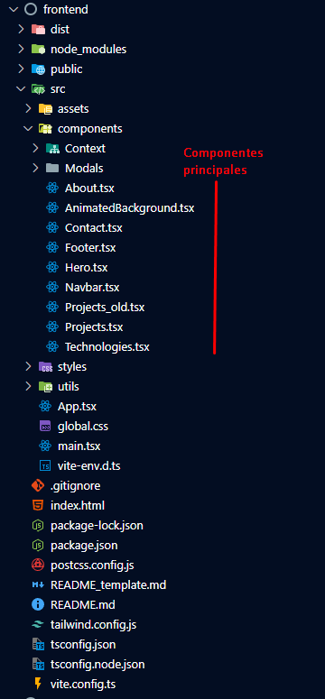
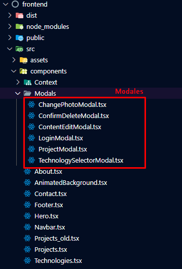
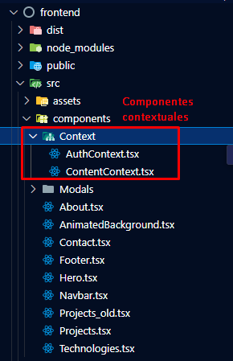
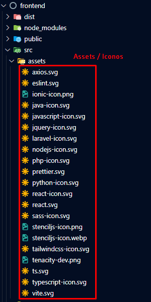

# Portfolio Leonard Craciun

Este proyecto es mi portfolio personal desarrollado con tecnologías modernas y efectos visuales profesionales.

## 🔧 Tecnologías
- React + Vite + TypeScript
- TailwindCSS + Animaciones con Framer Motion
- hCaptcha + Formspree para formulario seguro
- Despliegue en Dokku (o Vercel/Netlify)

## 🧩 Características
- Diseño responsive y futurista
- Carrusel de proyectos con imágenes
- Efecto glassmorphism + neón
- Contacto funcional con validación y captcha

## 🖼️ Capturas de pantalla

### Componentes principales (frontend)

### Modales (frontend)

### Componentes de contexto (frontend)

### Assets / Iconos (frontend)
